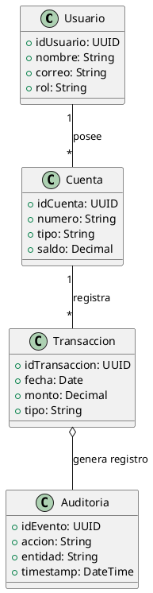

# Foro: Pregunta 5 — ¿Qué metodología usarías en un sistema bancario?

## Enunciado
En este foro, los estudiantes analizarán las implicaciones de escoger una metodología de desarrollo adecuada para un sistema crítico como el bancario. El objetivo es reflexionar sobre los niveles de control, documentación, riesgos, seguridad y estabilidad que requiere un entorno financiero, y cómo se adaptan a metodologías como RUP o SCRUM.

### Pregunta 5
> Si estuvieras liderando el proyecto, ¿qué enfoque metodológico adoptarías y cómo lo justificarías ante tu equipo?

---

## 📘 Resumen – Reflexión

Si estuviera liderando el desarrollo de un sistema bancario, adoptaría un **enfoque metodológico híbrido** que combine lo mejor de **SCRUM** (agilidad, iteraciones cortas, entregas incrementales) con la **estructura y trazabilidad de RUP** (procesos definidos, documentación formal, control de riesgos y cumplimiento normativo).

En un entorno financiero, los proyectos requieren **rigor documental**, **control de versiones**, **trazabilidad de requisitos**, y una **gestión estricta de la seguridad y los riesgos**. SCRUM por sí solo puede resultar insuficiente, ya que su filosofía ligera y flexible no garantiza la generación de artefactos auditables, mientras que RUP, aunque robusto, puede ser demasiado rígido y lento para un mercado que demanda respuestas ágiles.

Por ello, el enfoque híbrido se sustenta en:

- **SCRUM** para la gestión diaria: backlog priorizado, sprints de 2 a 3 semanas, reuniones de revisión y retrospectiva.
- **RUP** como capa de gobernanza: definición de fases (Inicio, Elaboración, Construcción, Transición), plantillas de documentación, control de versiones y trazabilidad formal entre requisitos, código y pruebas.

### Justificación ante el equipo

> “Nuestro objetivo no es solo entregar rápido, sino entregar con confianza y cumplimiento. Usaremos SCRUM para mantenernos ágiles y RUP para mantenernos auditables”.

Así, cada sprint incluiría entregables técnicos y documentales:
- Historias de usuario con trazabilidad a requisitos formales.
- Evidencia de pruebas automatizadas y revisiones de código.
- Reportes de seguridad y auditoría.
- Integración continua con trazabilidad (CI/CD auditado).

Este modelo asegura la adaptabilidad de SCRUM sin comprometer la estabilidad que exige la banca.

---

## 📚 Bibliografía

- Kruchten, P. (2004). *The Rational Unified Process: An Introduction*. Addison-Wesley.
- Sommerville, I. (2016). *Software Engineering (10th Edition)*. Pearson.
- Ambler, S. (2002). *Agile Modeling: Effective Practices for eXtreme Programming and the Unified Process*. Wiley.
- Fowler, M. (2006). *Continuous Integration*. martinfowler.com.
- ISO/IEC 27001 — *Gestión de Seguridad de la Información*.
- OWASP ASVS — *Application Security Verification Standard*.
- PCI DSS — *Payment Card Industry Data Security Standard*.

---

## 🧩 C4 Model – Contexto y Contenedores (PlantUML)

```plantuml
@startuml C4_Context
!define C4P https://raw.githubusercontent.com/plantuml-stdlib/C4-PlantUML/master
!includeurl C4P/C4_Context.puml
!includeurl C4P/C4_Container.puml

Person(cliente, "Cliente del Banco", "Persona que utiliza servicios bancarios")
System_Boundary(s1, "Banco Centralizado") {
  Container(webapp, "Portal Bancario", "React/Node.js", "Interfaz de usuario para operaciones")
  Container(api, "API Gateway", "Spring Boot", "Gestiona solicitudes y seguridad")
  Container(core, "Core Banking System", "Java/.NET", "Procesa cuentas, préstamos y transacciones")
  Container(db, "Base de Datos Transaccional", "PostgreSQL", "Registra movimientos y auditorías")
}

Rel(cliente, webapp, "Realiza operaciones, consultas y pagos")
Rel(webapp, api, "Envía solicitudes seguras")
Rel(api, core, "Procesa operaciones y aplica reglas de negocio")
Rel(core, db, "Persiste datos y registra eventos de auditoría")

@enduml
```

---

## 🧱 UML — Diagrama de Clases Simplificado (PlantUML)



---

## 💡 Conclusión

Adoptar una **metodología híbrida SCRUM–RUP** permite equilibrar la **agilidad del desarrollo** con la **formalidad y control** requeridos por el entorno bancario.  
Este enfoque minimiza riesgos, garantiza trazabilidad y asegura la entrega continua de valor **sin comprometer la seguridad ni la conformidad regulatoria**.
